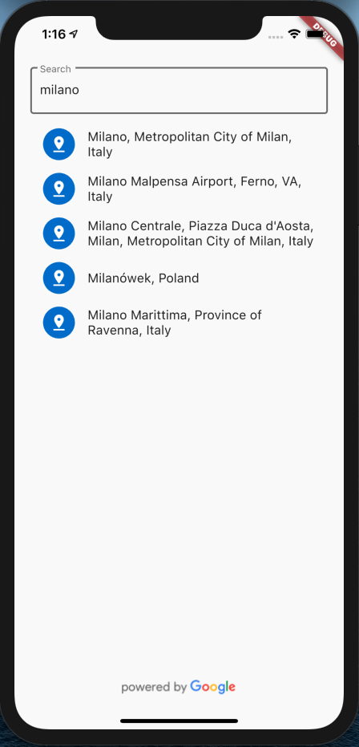
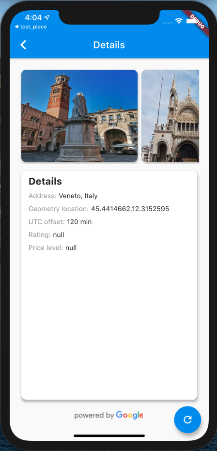

# example

An example for **_goole_place_** package.

## Preview

- Home page

  

- Details page

  

## Getting Started

- Create **_.env_** file in example directory
- Add your Google Place API key in this file (ex: API_KEY=XXXXXXXXXXX)
- Get packages from the command line: **_flutter pub get_**
